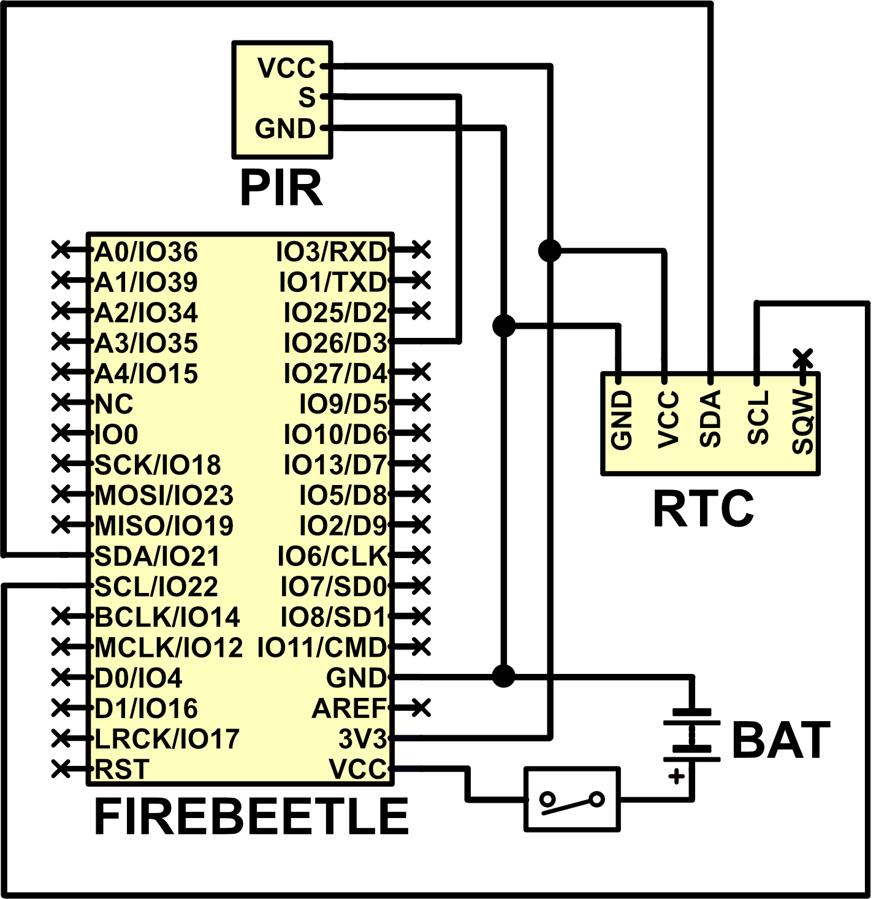

# LEM: Lemming Enumeration Module
Authors: Authors: Gabriel Bergeron*, Mireille Quémener*, Thomas Shooner, Christopher Mathault, Nathan Bérubé, Daniel Côté, Dominique Fauteux, Pierre Legagneux

![[LEM_device.png]]
## Context
This project focuses on the development of a monitoring device for small mammals, specifically targeting the lemming. The device is designed for deployment in extreme environments, such as the Arctic.

## How it works
The LEM functions as a **passive event logger** using an infrared sensor to detect the passage of small mammals, who emmit IR radiation.
- **Detection Trigger:** The device uses a Passive Infrared (PIR) sensor (AM312) positioned at the intersection of the tunnel and the electronics enclosure. When a small mammal enters the tube, its body heat creates a thermal contrast that triggers the sensor.
- **Wake-on-Interrupt:** To minimize battery consumption, the microcontroller remains in a "deep sleep" state. The PIR sensor is the only component that actively wakes the FireBeetle ESP32 by sending a high signal to a specific I/O pin when motion is detected.
- **Data Logging:** Once awakened, the system immediately pulls a precise date and time from the Real-Time Clock (RTC). This information is saved as a single timestamp entry in the onboard SPIFFS (Serial Peripheral Interface Flash File System) memory. The RTC ensures long-term accurate time keeping even in cold weather. 
- **No Species Identification:** It is important to note that the sensor is **species-blind**; it records the presence of an animal based on heat and motion but cannot distinguish between different small mammals, such as brown lemmings, collared lemmings, or shrews.

### Mechanical Assembly
The LEM device is designed as single-unit instrument to withstand extreme Arctic conditions, including flooding, permafrost, and sub-zero temperatures.
- **Main body:** of a $2.5 \times 2.5$ inch rectangular tunnel integrated with a top-mounted electronics enclosure. The unit is manufactured via thermoplastic molding using black MD-70 polyurethane elastomer, chosen for its durability and resistance to UV degradation and extreme temperatures.
- **Waterproofing:** The electronics lid is secured with screws and sealed against a rubber gasket. The PIR sensor and the power switch are further sealed into the chassis using epoxy resin to prevent water infiltration.
- **Deployment:** The device is placed directly on the ground and secured along small mammal paths using metal pegs. Its tunnel dimensions are specifically designed to be compatible with existing live-traps to ensure consistent animal usage probabilities.

### Electronic System
The LEM circuit is optimized for ultra-low power consumption, enabling autonomous operation in remote environments for over a year on standard AA alkaline batteries.
- **Microcontroller:** we selected the **DFRobot FireBeetle ESP32-E** for its deep-sleep capabilities and 1mW standby power draw (for the circuit in this project).
- **Sensing:** Uses an **AM312 Passive Infrared (PIR) sensor**. When motion is detected in the tunnel, the PIR signal wakes the microcontroller to log the event.
- **Data Logging:** Each detection is recorded as a time-stamped entry in the FireBeetle’s onboard **SPIFFS memory**.
- **Timekeeping:** Includes an **Adafruit PCF8523 Real-Time Clock (RTC)** module powered by a dedicated lithium coin cell to maintain accurate time across deep-sleep cycles and cold-induced power fluctuations.
- **Power Supply:** Operates on **three AA alkaline batteries** (4.5V total). Field tests show the system can maintain sufficient voltage for over 390 days of operation at average temperatures of -9°C.
- **Interface:** Features a waterproof external **rocker switch (ZF Electronics KRE2ANA1BBD)** for field activation/deactivation. Data is retrieved via a standard **USB connection** to the FireBeetle.
- **Custom PCB**: a custom PCB was designed for the spectific needs of this project. 

## What you will find in this repository
**Important:** The LEM device deployed at Bylot Island represents **Version 3**. For the record, two previous prototypes were designed and tested before converging on this final iteration.
### Codes
All Arduino-based source code required for field deployment is located in `Code/v3/SPIFFS_PCF8523`. If you are using the DS1307 RTC module instead of the PCF8523, use the version found in `Code/v3/SPIFFS_DS1307`.

The workflow is divided into three distinct phases to match the deployment cycle:
- **Initialization (`init_lem_v3_pcf8523`):** This code is uploaded to the FireBeetle before field deployment to reinitialize the system and wipe all existing data from the SPIFFS memory. This should be run prior to every new deployment.
- **Deployment (`main_lem_v3_pcf8523`):** Once initialized, upload this code to place the device into "deployment mode". When the rocker switch is toggled on, the device creates a "startFile" with a timestamp to mark the beginning of the session and begins logging lemming activity. Every power cycle (off/on) generates a new timestamped "startFile".
- **Data Retrieval (`read_lem_v3_pcf8523`):** After retrieving the device from the field and powering it down, upload this code to output the stored SPIFFS data to the serial terminal.

**Data Downloader Utility:** After uploading the retrieval code, you can use our standalone desktop utility (available for Windows 64-bit) to download data directly to your computer. This utility includes a simple UI to select the FireBeetle's COM port and your destination folder. You can find this program under the **Releases** section.
### CAD files
The `CAD` folder contains **STEP files** of the full LEM assembly. Native project files (Fusion360 or SolidWorks) are available upon request.
### PCB files
**Gerber files** for the PCB are located in `PCB/LEM_v3/gerberFiles`.
